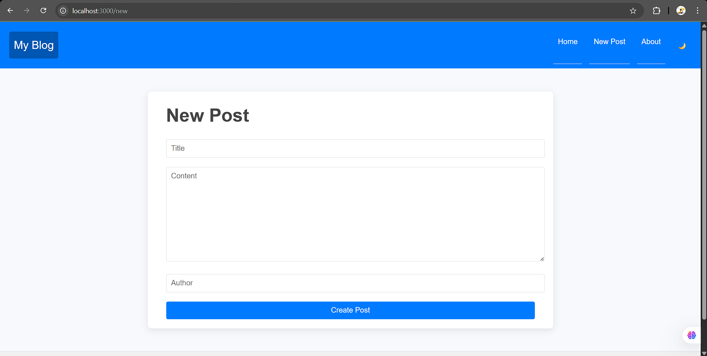

# 📝 Blog Post Project

A simple blog application built with **Express.js, EJS, and Axios**.  
It supports **Create, Edit, Delete posts** with a REST API backend.

## 🚀 Features
- Create, edit, and delete blog posts
- Mobile-responsive navbar
- Dark/Light mode toggle
- Header & footer with EJS partials
- REST API backend with Express
- In-memory data store (can be replaced with DB)

## 🛠️ Tech Stack
- **Frontend:** Express + EJS
- **Backend:** Express REST API
- **Styling:** Vanilla CSS
- **Language:** JavaScript (Node.js)

## 📂 Project Structure
blog-post/
│── server.js           # frontend server (Express + EJS)
│── index.js            # backend API (Express REST API)
│── package.json
│── public/
│    ├── styles/
│    │   └── main.css
│    └── scripts/
│        └── main.js
│── views/
│    ├── index.ejs
│    ├── modify.ejs
│    └── partials/
│        ├── header.ejs
│        └── footer.ejs
│── README.md           # documentation
│── .gitignore

